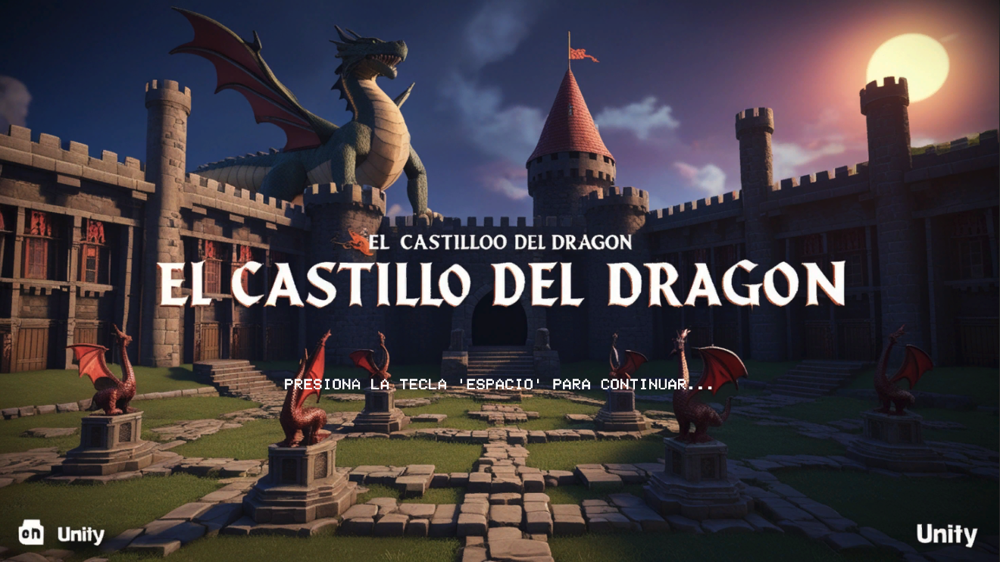
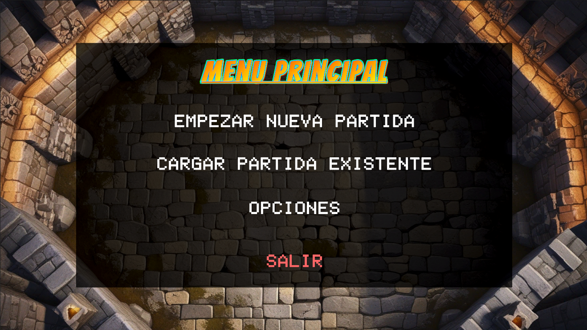
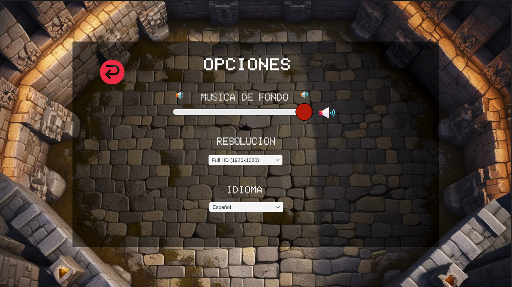
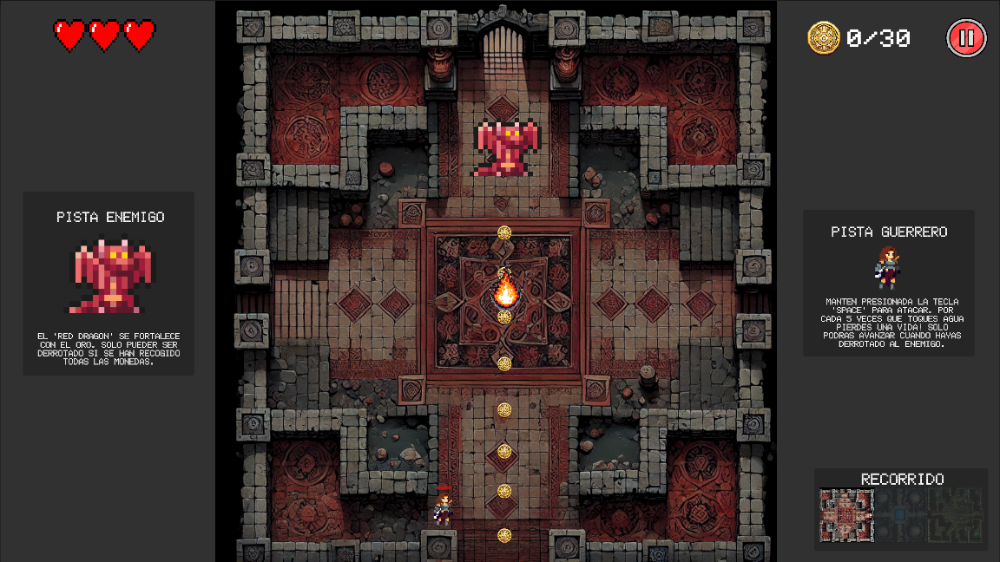
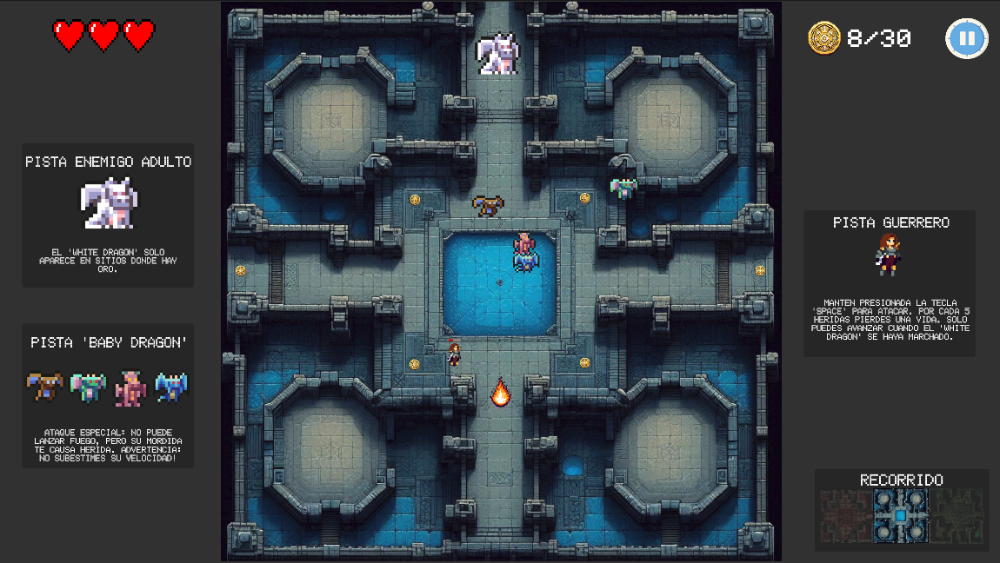
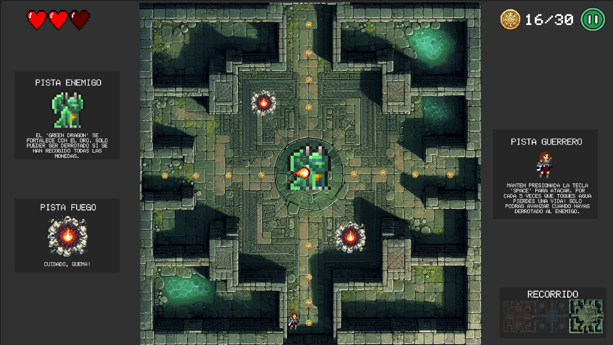
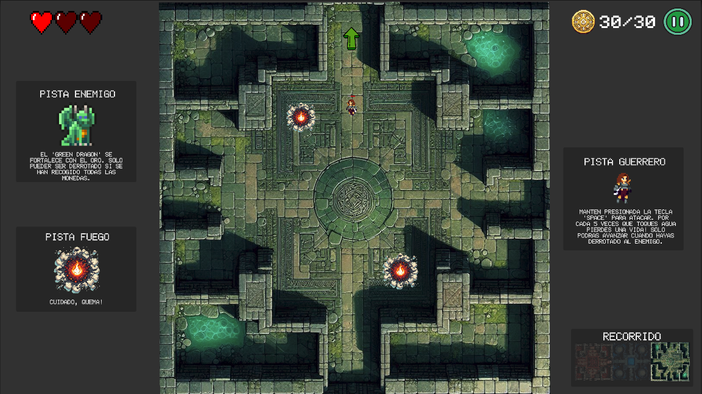
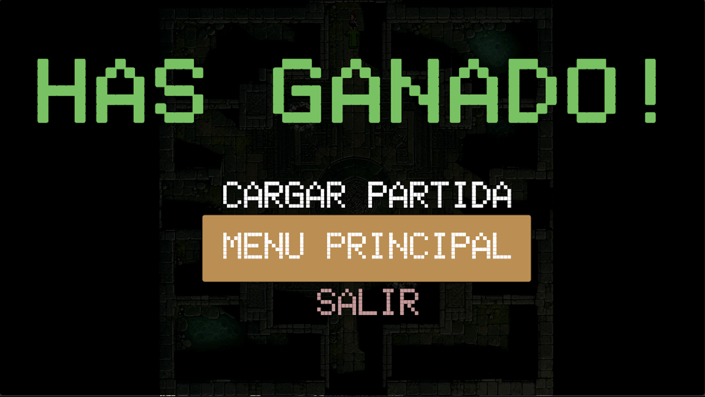
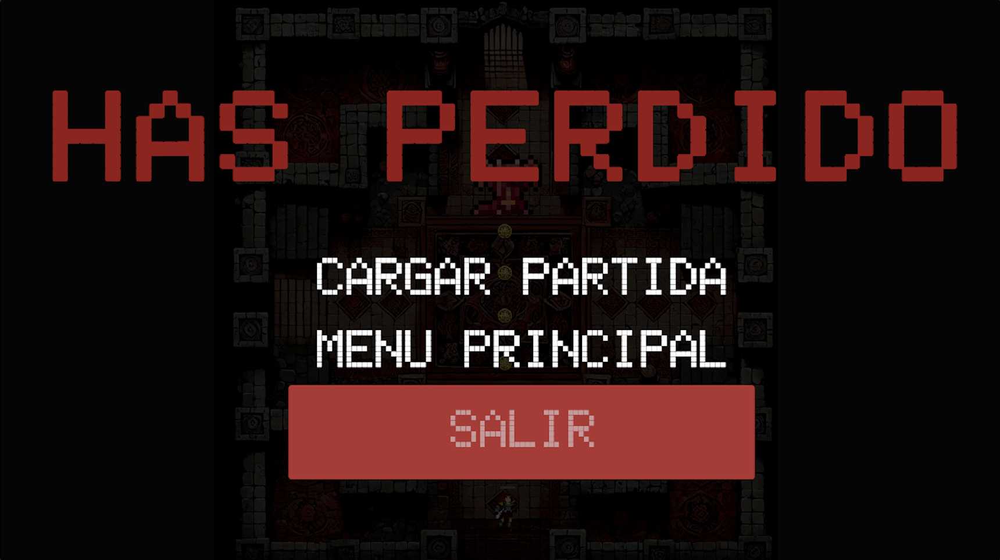

# TheCastleDragon
Juego 2D Unity

Juego 2D completamente desarrollado en Unity, actualmente con 3 niveles disponibles. Existen planes para futuras ampliaciones.

## Características actuales:
- **Menú principal** con opciones para iniciar el juego y acceder a los ajustes.
  
- **Menú de pausa** para detener el juego en cualquier momento.
  
- **Guardado de partida en formato JSON**, aunque aún en desarrollo con algunos errores que deben corregirse.
- **Carga de partida en formato JSON**.
- **Ajustes de resolución** disponibles en el menú de opciones, aunque con algunos problemas que deben ser solucionados.
  
- **Traducción al español e inglés** mediante JSON.
- **Ajuste de volumen** disponible con opción de mutearlo.

> **Nota**: El juego sigue en desarrollo, por lo que algunas funcionalidades, como el guardado y la carga de partidas, no están completamente pulidas.

